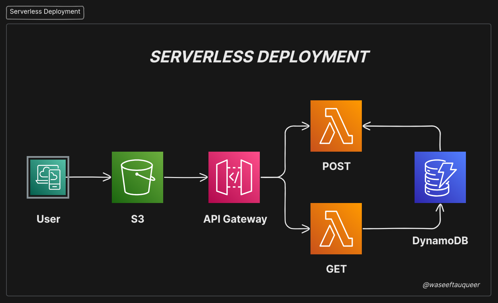

# **Deploying a Serverless Web Application on AWS: S3, API Gateway, Lambda, and DynamoDB**

This guide walks you through deploying a serverless web application on AWS using **S3**, **API Gateway**, **Lambda**, and **DynamoDB**. Serverless computing allows developers to focus on writing code without managing infrastructure, as AWS handles the underlying servers.

---

## **Overview of Services Used**

1. **Amazon S3 (Simple Storage Service)**: Hosts static files (HTML, CSS, JavaScript) for the web application.
2. **Amazon API Gateway**: Provides a RESTful API to interact with backend services.
3. **AWS Lambda**: Executes serverless functions to handle backend logic (e.g., fetching or inserting data into DynamoDB).
4. **Amazon DynamoDB**: A NoSQL database to store and retrieve application data.

---

## **Step 1: Create a DynamoDB Table**

1. Go to the **DynamoDB Dashboard** in the AWS Management Console.
2. Click **Create Table**.
3. Provide a **Table Name** (e.g., `studentData`).
4. Define the **Partition Key** (e.g., `studentid`). This key uniquely identifies each item in the table.
5. Leave other settings as default and click **Create**.

### **What is a Partition Key?**
- The **Partition Key** is a primary component of the **Primary Key** in DynamoDB.
- It determines how data is distributed across partitions.
- DynamoDB hashes the Partition Key value to assign the item to a specific partition.

---

## **Step 2: Create Lambda Functions**

### **Lambda Function 1: Fetch Data from DynamoDB (`getStudent`)**
1. Go to the **Lambda Dashboard** and click **Create Function**.
2. Name the function (e.g., `getStudent`).
3. Select the runtime (e.g., Python 3.x).
4. Choose or create an **IAM Role** with permissions to access DynamoDB.
5. Write the Lambda function to fetch data from DynamoDB. Use the following code:
   ```python
   import json
   import boto3

   def lambda_handler(event, context):
       # Initialize a DynamoDB resource object for the specified region
       dynamodb = boto3.resource('dynamodb', region_name='us-east-2')

       # Select the DynamoDB table named 'studentData'
       table = dynamodb.Table('studentData')

       # Scan the table to retrieve all items
       response = table.scan()
       data = response['Items']

       # If there are more items to scan, continue scanning until all items are retrieved
       while 'LastEvaluatedKey' in response:
           response = table.scan(ExclusiveStartKey=response['LastEvaluatedKey'])
           data.extend(response['Items'])

       # Return the retrieved data
       return data
   ```
6. Click **Deploy**.

### **Lambda Function 2: Insert Data into DynamoDB (`insertStudentData`)**
1. Create another Lambda function (e.g., `insertStudentData`).
2. Write the Lambda function to insert data into DynamoDB. Use the following code:
   ```python
   import json
   import boto3

   # Create a DynamoDB object using the AWS SDK
   dynamodb = boto3.resource('dynamodb')
   # Use the DynamoDB object to select our table
   table = dynamodb.Table('studentData')

   # Define the handler function that the Lambda service will use as an entry point
   def lambda_handler(event, context):
       # Extract values from the event object we got from the Lambda service and store in variables
       student_id = event['studentid']
       name = event['name']
       student_class = event['class']
       age = event['age']
       
       # Write student data to the DynamoDB table and save the response in a variable
       response = table.put_item(
           Item={
               'studentid': student_id,
               'name': name,
               'class': student_class,
               'age': age
           }
       )
       
       # Return a properly formatted JSON object
       return {
           'statusCode': 200,
           'body': json.dumps('Student data saved successfully!')
       }
   ```
3. Click **Deploy**.

### **Testing the Lambda Functions**
1. Go to the **Test** tab in the Lambda console.
2. Create a test event with sample data (e.g., `{ "studentid": "1", "name": "John", "class": "10", "age": 20 }`).
3. Run the test to verify the function works as expected.

---

## **Step 3: Create an API Gateway**

1. Go to the **API Gateway Dashboard** and click **Create API**.
2. Choose **HTTP API** or **REST API** (for this guide, use REST API).
3. Select **Edge Optimized** for global accessibility.
4. Create two methods:
   - **GET**: Integrate with the `getStudent` Lambda function.
   - **POST**: Integrate with the `insertStudentData` Lambda function.
5. Deploy the API:
   - Go to **Actions** → **Deploy API**.
   - Create a new stage (e.g., `prod`).
6. Note the **Invoke URL** generated after deployment (e.g., `https://<api-id>.execute-api.<region>.amazonaws.com/prod`).

### **Enable CORS**
1. Go to **Resources** → **Actions** → **Enable CORS**.
2. Select the **GET** and **POST** methods.
3. Save and redeploy the API.

---

## **Step 4: Host the Frontend on S3**

1. Go to the **S3 Dashboard** and create a new bucket (e.g., `my-serverless-app`).
2. Upload your static files (e.g., `index.html`, `script.js`, `style.css`).
3. Enable **Static Website Hosting**:
   - Go to **Properties** → **Static website hosting**.
   - Enable hosting and set `index.html` as the index document.
4. Make the bucket publicly accessible:
   - Go to **Permissions** → **Bucket Policy**.
   - Add the following policy:
     ```json
     {
       "Version": "2012-10-17",
       "Statement": [
         {
           "Effect": "Allow",
           "Principal": "*",
           "Action": "s3:GetObject",
           "Resource": "arn:aws:s3:::my-serverless-app/*"
         }
       ]
     }
     ```
5. Note the **Endpoint URL** provided under **Static website hosting** (e.g., `http://my-serverless-app.s3-website-<region>.amazonaws.com`).

---

## **Step 5: Connect Frontend to Backend**

1. Update your `script.js` file to use the **API Gateway Invoke URL** (from the `prod` stage). Use the following code:
   ```javascript
   // Add your API endpoint here
   var API_ENDPOINT = "YOUR ENDPOINT";

   // AJAX POST request to save student data
   document.getElementById("savestudent").onclick = function(){
       var inputData = {
           "studentid": $('#studentid').val(),
           "name": $('#name').val(),
           "class": $('#class').val(),
           "age": $('#age').val()
       };
       $.ajax({
           url: API_ENDPOINT,
           type: 'POST',
           data:  JSON.stringify(inputData),
           contentType: 'application/json; charset=utf-8',
           success: function (response) {
               document.getElementById("studentSaved").innerHTML = "Student Data Saved!";
           },
           error: function () {
               alert("Error saving student data.");
           }
       });
   }

   // AJAX GET request to retrieve all students
   document.getElementById("getstudents").onclick = function(){  
       $.ajax({
           url: API_ENDPOINT,
           type: 'GET',
           contentType: 'application/json; charset=utf-8',
           success: function (response) {
               $('#studentTable tr').slice(1).remove();
               jQuery.each(response, function(i, data) {          
                   $("#studentTable").append("<tr> \
                       <td>" + data['studentid'] + "</td> \
                       <td>" + data['name'] + "</td> \
                       <td>" + data['class'] + "</td> \
                       <td>" + data['age'] + "</td> \
                       </tr>");
               });
           },
           error: function () {
               alert("Error retrieving student data.");
           }
       });
   }
   ```
2. Upload the updated `script.js` to your S3 bucket.

---

## **Step 6: Test the Application**


1. Open the S3 static website endpoint in a browser.
2. Verify that the frontend can fetch and insert data into DynamoDB via the API Gateway.

---

## **Final Notes**

- **CORS Configuration**: Ensure CORS is enabled in both API Gateway and S3 if your frontend and backend are on different domains.
- **Security**: Use IAM roles and policies to restrict access to your resources.
- **Scaling**: DynamoDB and Lambda automatically scale to handle increased traffic.

By following these steps, you’ve successfully deployed a serverless web application on AWS! 🚀
